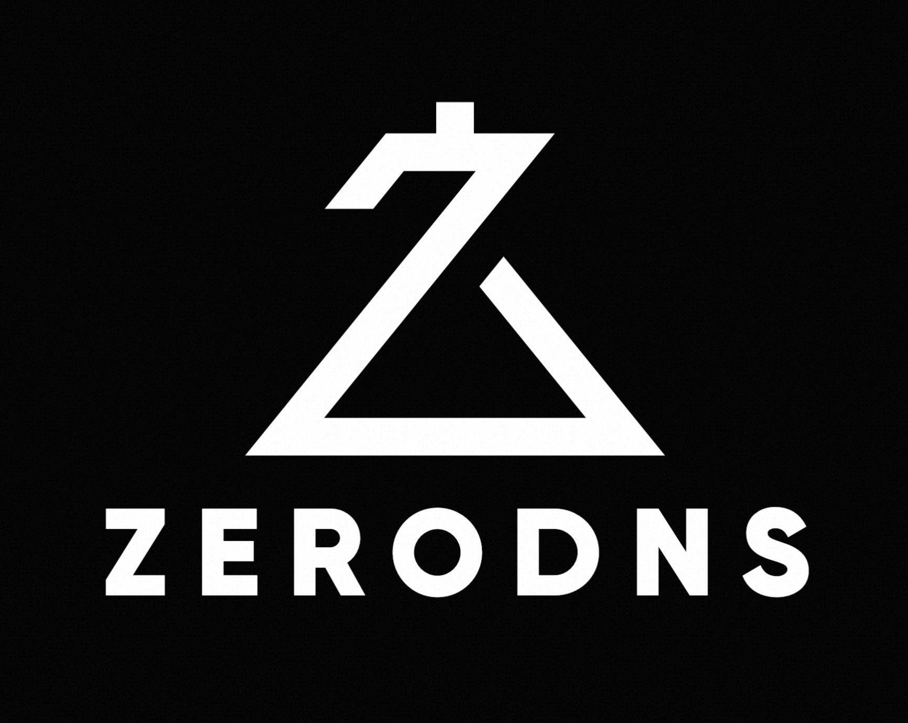

# ZeroDNS


[](https://app.codecov.io/gh/jjeffcaii/zerodns)
[](https://crates.io/crates/zerodns)
[](https://crates.io/crates/zerodns)


a DNS server in Rust, which is inspired from chinadns/dnsmasq.

> WARNING: still in an active development!!!

## Goals

- multiple protocols: UDP/TCP/DoT/DoT/DNSCrypt
- user-defined filters, includes lua or native rust codes

## Quick Start

> Notice: ensure you have [just](https://github.com/casey/just) installed on your machine!

run an example:

```shell
$ just r
```
